# Amazon Prime Video — SQL Content Analysis


**Tools Used:** SQLite, Excel, Power BI

[Dataset Used](https://www.kaggle.com/datasets/victorsoeiro/netflix-tv-shows-and-movies)

[SQL Analysis (Code)](amazon_prime_analysis.sql)

- **Business Problem:** Amazon Prime Video wants to gather useful insights on their shows and movies for their subscribers through their datasets. The issue is they are working with a large amount of data across two tables — nearly 10,000 titles and 124,000 cast and crew records — and need a way to effectively analyze and extract meaningful insights from it. They need a data analytics solution to uncover valuable patterns and trends around content quality, audience ratings, country of origin, and talent.

- **How I Plan On Solving the Problem:** Using SQL in DB Browser for SQLite, I will query both the titles and credits datasets to answer key business questions. By leveraging SQL functions like AVG, COUNT, GROUP BY, JOIN, and HAVING, I can uncover metrics such as IMDB ratings, content volume by country and decade, top performing actors and directors, and age certification trends. Once the data has been extracted, I will use Power BI to present the findings through an interactive dashboard.

---

## Questions I Wanted To Answer From the Dataset:

## 1. Which movies and shows on Amazon Prime ranked in the top 10 and bottom 10 based on their IMDB scores?

* Top 10 Movies

```sql
SELECT title, type, imdb_score
FROM titles
WHERE type = 'MOVIE'
AND imdb_score IS NOT NULL
ORDER BY imdb_score DESC
LIMIT 10;
```

Result:

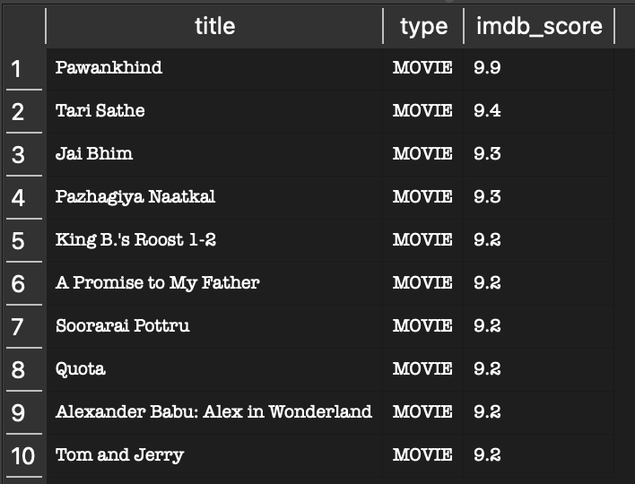

* Bottom 10 Movies

```sql
SELECT title, type, imdb_score
FROM titles
WHERE type = 'MOVIE'
AND imdb_score IS NOT NULL
ORDER BY imdb_score ASC
LIMIT 10;
```

Result:

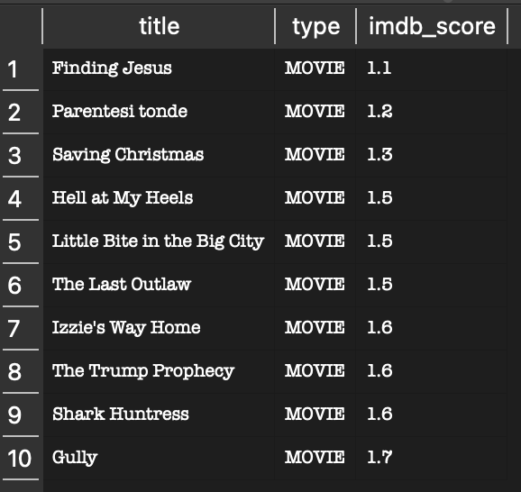

* Top 10 Shows

```sql
SELECT title, type, imdb_score
FROM titles
WHERE type = 'SHOW'
AND imdb_score IS NOT NULL
ORDER BY imdb_score DESC
LIMIT 10;
```

Result:

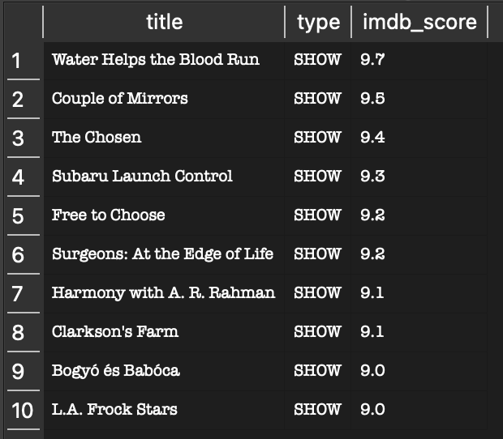

* Bottom 10 Shows

```sql
SELECT title, type, imdb_score
FROM titles
WHERE type = 'SHOW'
AND imdb_score IS NOT NULL
ORDER BY imdb_score ASC
LIMIT 10;
```

Result:

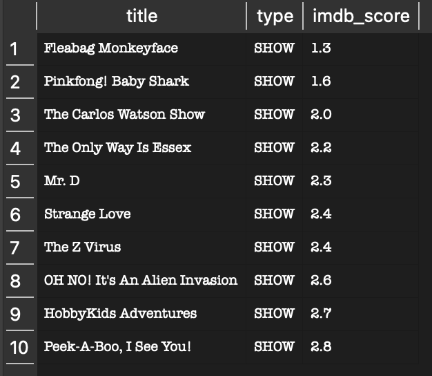

The top 10 movies and shows stood out for their exceptional IMDB scores, with Pawankhind leading movies at 9.9 and Water Helps the Blood Run leading shows at 9.7. Notably, Indian cinema dominates the top movie rankings, reflecting Amazon Prime's strong investment in international content. On the other hand, the bottom 10 titles scored as low as 1.1 for movies and 1.3 for shows. While these low scores may reflect niche or low-budget productions, it highlights the wide range of content quality across the platform.

## 2. How does the average IMDB score differ between Movies and Shows?

```sql
SELECT type, ROUND(AVG(imdb_score), 2)
FROM titles
GROUP BY type;
```

Result:

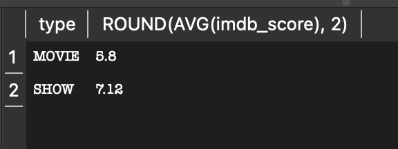

Shows average a significantly higher IMDB score (7.12) compared to movies (5.8). This gap suggests that Amazon Prime's TV show catalog is generally better received by audiences than its movie library. This could indicate that Amazon's original and licensed shows tend to be higher quality productions, or that movies on the platform skew toward lower-budget titles.

## 3. Which genre combinations have the highest average IMDB scores?

```sql
SELECT genres, ROUND(AVG(imdb_score), 2)
FROM titles
WHERE genres IS NOT NULL
AND imdb_score IS NOT NULL
GROUP BY genres
ORDER BY imdb_score DESC
LIMIT 10;
```

Result:

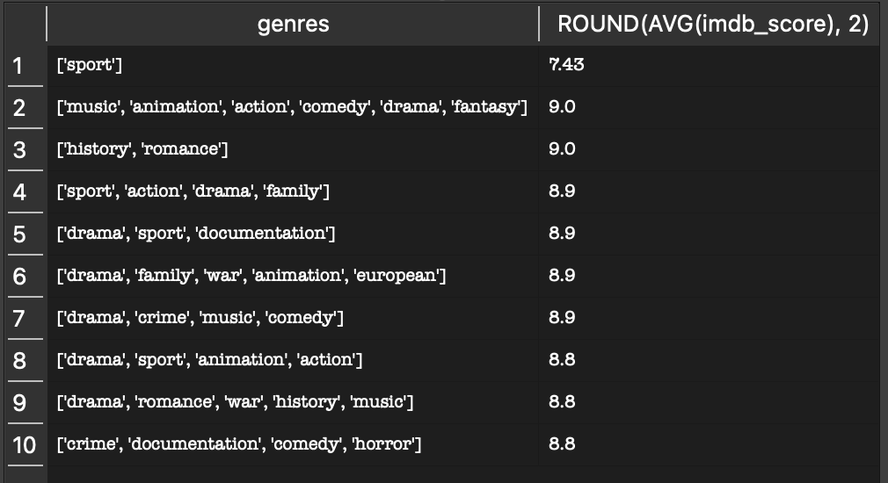

Sport-related and drama-heavy genre combinations tend to score highest on the platform. It is worth noting that genres in this dataset are stored as combined lists rather than individual tags, so these results reflect genre combinations rather than single genres. This is a known data limitation acknowledged in the analysis.

## 4. Which production countries output the most content on Amazon Prime?

```sql
SELECT production_countries, COUNT(*)
FROM titles
GROUP BY production_countries
ORDER BY COUNT(*) DESC
LIMIT 10;
```

Result:

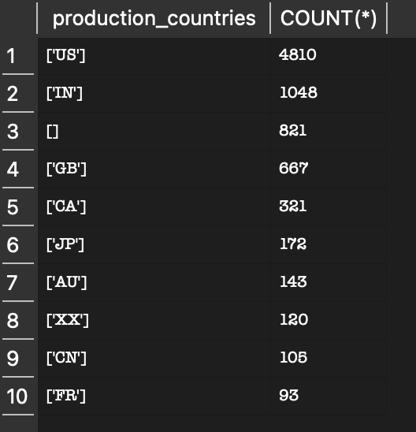

The United States dominates Amazon Prime's catalog with 4,810 titles, followed by India with 1,048 and the United Kingdom with 667. This reflects Amazon's heavy investment in US and English-language content while also showing a significant presence of Indian cinema. Similar to genres, production countries are stored as lists in this dataset, which is a noted data limitation.

## 5. Who are the most frequently appearing actors on Amazon Prime?

```sql
SELECT name, COUNT(*) as appearances
FROM credits
WHERE role = 'ACTOR'
GROUP BY name
ORDER BY appearances DESC
LIMIT 10;
```

Result:

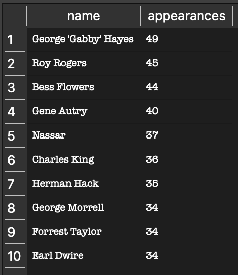

George 'Gabby' Hayes leads all actors with 49 appearances, followed by Roy Rogers with 45 and Bess Flowers with 44. The prevalence of classic Hollywood era actors at the top of this list suggests Amazon Prime carries a large catalog of older films, particularly westerns from the 1930s and 1940s.

## 6. Which directors have the highest average IMDB score with a minimum of 2 titles?

```sql
SELECT name, ROUND(AVG(t.imdb_score), 2) as avg_score, COUNT(*) as titles
FROM credits c
JOIN titles t ON c.id = t.id
WHERE c.role = 'DIRECTOR'
AND t.imdb_score IS NOT NULL
GROUP BY name
HAVING COUNT(*) >= 2
ORDER BY avg_score DESC
LIMIT 10;
```

Result:

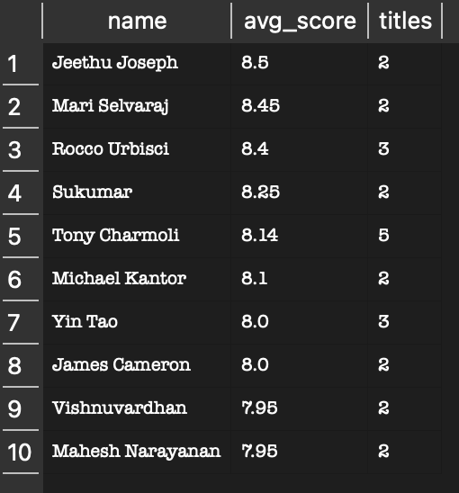

Jeethu Joseph leads all directors with an average IMDB score of 8.5 across 2 titles. James Cameron also appears in the top 10, validating the reliability of the metric. Requiring a minimum of 2 titles ensures results reflect consistent quality rather than a single standout film.

## 7. How many titles fall into each decade in Amazon Prime's library?

```sql
SELECT CONCAT(FLOOR(release_year / 10) * 10, 's') AS decade,
COUNT(*) AS count
FROM titles
GROUP BY decade
ORDER BY decade;
```

Result:

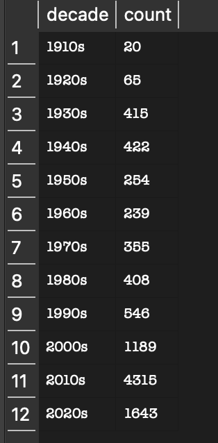

Amazon Prime's catalog spans over a century of content dating back to the 1910s. Content volume grows significantly from the 2000s onward, with the 2010s seeing a massive spike of 4,315 titles. This reflects the global streaming boom and Amazon's aggressive content acquisition strategy during that decade.

## 8. How does average IMDB score vary by age certification?

```sql
SELECT age_certification, ROUND(AVG(imdb_score), 2) as avg_score, COUNT(*) as titles
FROM titles
WHERE age_certification IS NOT NULL
AND imdb_score IS NOT NULL
GROUP BY age_certification
ORDER BY avg_score DESC;
```

Result:

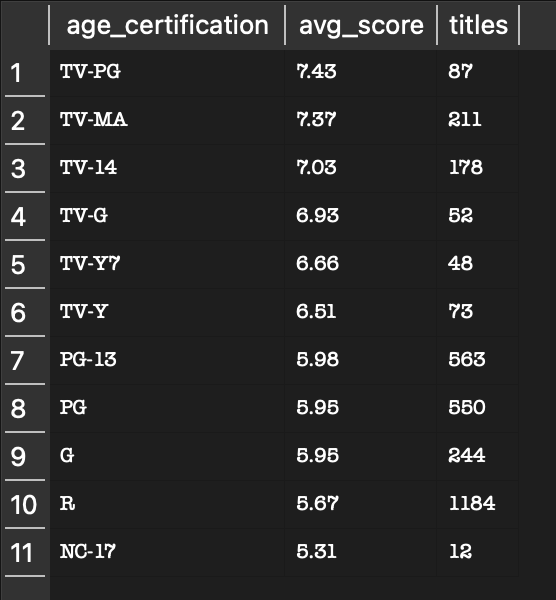

TV-PG content scores highest on average at 7.43, followed closely by TV-MA at 7.37. Interestingly, R-rated movies score the lowest among certified content at 5.67. This suggests that TV content, regardless of rating, tends to be better received by audiences than movies on the platform.

## Conclusion

Through this analysis of Amazon Prime Video's content library, several valuable insights emerged. The platform hosts a wide range of quality, from exceptional titles scoring near 10.0 to critically panned content scoring below 2.0. Shows consistently outperform movies in average IMDB score, suggesting stronger quality control in Amazon's TV catalog. The United States dominates content production, but Indian cinema is a strong second presence. Classic Hollywood actors dominate appearance counts, revealing a deep catalog of older films. Content production exploded in the 2010s, and TV-PG and TV-MA certifications tend to produce the highest rated content on the platform.
